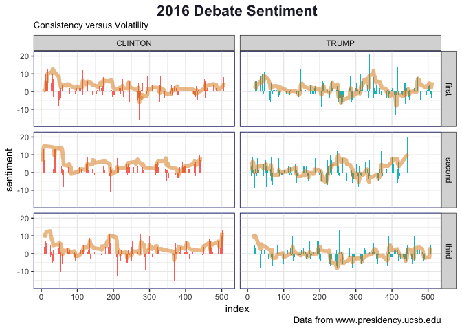

# THREE PRESIDENTIAL DEBATES
WW44SS  
Oct 22, 2016  


###SUMMARY
Can we learn anything about a debate and it's outcome from a "sentiment" analysis?  
It was widely reported that Donald Trump's performances in the debates were marred by uneven performance. To paraphrase, he was able to stick to a script for the first part of the debate, until he got either mad or braggadocious.    

* [Donald Trump Loses Discipline In Final Debate; Says He Might Reject Election Results](http://www.usnews.com/news/politics/articles/2016-10-20/donald-trump-loses-discipline-in-final-debate-says-he-might-reject-election-results)  
* [Trump loses cool while Clinton stays calm during first presidential debate](https://www.theguardian.com/us-news/2016/sep/27/debate-clinton-trump-recap-presidential-election-hofstra)  

Can we see evidence of his uneven performance in relation to his rivals? It turns out we can. Using a "decaying weighted sum" to monitor sentiment trends, this analysis shows Hillary Clinton maintain uniform positive sentiment, while that of Donald Trump showed greater volatility, especially in the second halves of the debates.

###DATA SOURCES AND METHODS
The text of the debate are downloaded from the [UCSB Presidency Project](http://www.presidency.ucsb.edu/debates.php). Transcripts were pasted into Apple Pages and stored as unformatted .txt files.  

The .txt files are made tidy by a separate `.R` program which removes punctuation and annotation and then categorized by speaker. The data are stored as a .csv file which is loaded here for analysis. 

The menthods are similar to a [previous post on the VP debates](http://rpubs.com/ww44ss/vp_debate), so I have suppressed most of the code from this printout.


```r
## this is an identity helper-function useful for simplifying debug of piped analysis steps
## it does "nothing", but does so as a function.
yo <-function(x.x){return(x.x)}
doh <- function(x.x){return(x.x)}
RuhRoh <- function(x.x){return(x.x)}
```


```r
    library(dplyr)
    library(animation)
    #devtools::install_github("hadley/ggplot2")
    library(ggplot2)
    library(tidytext)
```


```r
## search for and read lightly cleaned debate text .csv
data_files <- list_of_files[grepl("_tidy", list_of_files)]


debate_df <- read.csv(paste0(directory, data_files[1]), stringsAsFactors = FALSE) %>% 
    as_data_frame
first_debate <- debate_df %>% mutate(debate = "first")

debate_df <- read.csv(paste0(directory, data_files[2]), stringsAsFactors = FALSE) %>% 
    as_data_frame
second_debate <- debate_df %>% mutate(debate = "second")

debate_df <- read.csv(paste0(directory, data_files[3]), stringsAsFactors = FALSE) %>% 
    as_data_frame
third_debate <- debate_df %>% mutate(debate = "third")

debate_text <- rbind(first_debate, second_debate, third_debate)
debate_text <- debate_text %>% select(debate, name, text, X)
```

We now begin processing by taking the text, unnesting the sentences, and removing stop words using the onix lexicon


```r
    ## compute stop_words_list
    list_of_stop_words <- stop_words %>%
        filter(lexicon == "snowball") %>% 
        select(word) %>% 
        yo

    ## create tidy df of debate words
    words_from_the_debate <- debate_text %>%
        unnest_tokens(word, text) %>%
        filter(!word %in% list_of_stop_words) %>% 
        yo
```

We create a "sentiment dictionary" from the information stored in the `tidytext` package and use a `left_join` to assicate words with the sentiment values.


To look at the trend of the sentiment, we can create an exponentially damped cummulative sum function to apply to the data. The idea is that words have immediate punch, but it wanes as time and words pass. So that's the idea...


We can now compute the sum of the sentiment and the cummulative sum.


```r
    ## compute sentiment of debate responses by regrouping and compute means and cumsums
    debate_sentiment <- debate_words_sentiments %>%
        group_by(debate, X, name) %>%
        summarize(sentiment = sum(sentiment)) %>%
        group_by(name) %>%
        #mutate(cumm_sent = cumsum(sentiment)) %>%
        mutate(cumm_sent = decay_sum(sentiment, decay_rate = 0.1)) %>%
        yo
```

The final step is to pull it all together to create a plot data frame. 


```r
## suppress announcer and audience questioner text
plot_df <- plot_df %>% filter(name == "TRUMP" | name == "CLINTON")
```


```r
ggplot(plot_df, aes(x = X, y = sentiment, fill = name)) +
                geom_bar(stat = 'identity', alpha = 1., width = 2) +
                geom_line(data = plot_df, aes(x=X, y = 15*cumm_sent/max(abs(plot_df$cumm_sent))), size = 2, color = "#DD8511", alpha = 0.5) +
                xlim(range(plot_df$X)) +
                ylim(range(plot_df$sentiment)) +
                xlab("index") +
        labs(
    title = "2016 Debate Sentiment",
    subtitle = "Consistency versus Volatility",
    caption = "Data from www.presidency.ucsb.edu"
  ) +
                facet_grid(debate~name) +
        theme_bw() + 
                theme(plot.title = element_text(size = 16, hjust = 0.5, color = "#222233", face="bold"), legend.position = "none", panel.background = element_rect(color = "#5566FF") )
```

<!-- -->


For what it's worth, here is the text of the most polarized statements


```r
full_text <- plot_df %>% inner_join(debate_text, by = c("debate", "X")) %>% ungroup()

knitr::kable(full_text %>% filter(sentiment < -10 | sentiment > 10) %>% select("debate" = debate, X, "name" = name.x, sentiment, "raw text" = text.y), caption = "Most Negative Sentiment Phrases")
```


Table: Most Negative Sentiment Phrases

debate      X  name       sentiment  raw text                                                                                                                                                                                                                                                                                                                                                                                                                                                                                                                                                                                                                                                                           
-------  ----  --------  ----------  -----------------------------------------------------------------------------------------------------------------------------------------------------------------------------------------------------------------------------------------------------------------------------------------------------------------------------------------------------------------------------------------------------------------------------------------------------------------------------------------------------------------------------------------------------------------------------------------------------------------------------------------------------------------------------------
first      18  CLINTON           13  finally we tonight are on the stage together donald trump and i donald it s good to be with you we re going to have a debate where we are talking about the important issues facing our country you have to judge us who can shoulder the immense awesome responsibilities of the presidency who can put into action the plans that will make your life better i hope that i will be able to earn your vote on november th                                                                                                                                                                                                                                                         
first      46  TRUMP             11  and what you do is you say fine you want to go to mexico or some other country good luck we wish you a lot of luck but if you think you re going to make your air conditioners or your cars or your cookies or whatever you make and bring them into our country without a tax you re wrong                                                                                                                                                                                                                                                                                                                                                                                        
first     115  CLINTON           12  but it s because i see this we need to have strong growth fair growth sustained growth we also have to look at how we help families balance the responsibilities at home and the responsibilities at business                                                                                                                                                                                                                                                                                                                                                                                                                                                                      
first     147  TRUMP             13  i m getting rid of the carried interest provision and if you really look it s not a tax it s really not a great thing for the wealthy it s a great thing for the middle class it s a great thing for companies to expand                                                                                                                                                                                                                                                                                                                                                                                                                                                           
first     242  CLINTON           11  and we ve got to do several things at the same time we have to restore trust between communities and the police we have to work to make sure that our police are using the best training the best techniques that they re well prepared to use force only when necessary everyone should be respected by the law and everyone should respect the law                                                                                                                                                                                                                                                                                                                               
first     251  TRUMP            -15  in chicago they ve had thousands of shootings thousands since january st thousands of shootings and i m saying where is this is this a war torn country what are we doing and we have to stop the violence we have to bring back law and order in a place like chicago where thousands of people have been killed thousands over the last number of years in fact almost have been killed since barack obama became president over almost people in chicago have been killed we have to bring back law and order                                                                                                                                                                   
first     272  CLINTON          -16  but there were some problems some unintended consequences too many young african american and latino men ended up in jail for nonviolent offenses and it s just a fact that if you re a young african american man and you do the same thing as a young white man you are more likely to be arrested charged convicted and incarcerated so we ve got to address the systemic racism in our criminal justice system we cannot just say law and order we have to say we have to come forward with a plan that is going to divert people from the criminal justice system deal with mandatory minimum sentences which have put too many people away for too long for doing too little 
first     337  TRUMP             21  i ll go one step further in palm beach florida tough community a brilliant community a wealthy community probably the wealthiest community there is in the world i opened a club and really got great credit for it no discrimination against african americans against muslims against anybody and it s a tremendously successful club and i m so glad i did it and i have been given great credit for what i did and i m very very proud of it and that s the way i feel that is the true way i feel                                                                                                                                                                             
first     411  TRUMP            -13  and one of your compatriots said you know whether it was before or right after trump was definitely because if you read this article there s no doubt but if somebody and i ll ask the press if somebody would call up sean hannity this was before the war started he and i used to have arguments about the war i said it s a terrible and a stupid thing it s going to destabilize the middle east and that s exactly what it s done it s been a disaster                                                                                                                                                                                                                       
first     416  TRUMP             14  i have a much better she spent let me tell you she spent hundreds of millions of dollars on an advertising you know they get madison avenue into a room they put names oh temperament let s go after i think my strongest asset maybe by far is my temperament i have a winning temperament i know how to win she does not have a                                                                                                                                                                                                                                                                                                                                                  
first     470  TRUMP             17  and she doesn t say that because she s got no business ability we need heart we need a lot of things but you have to have some basic ability and sadly she doesn t have that all of the things that she s talking about could have been taken care of during the last years let s say while she had great power but they weren t taken care of and if she ever wins this race they won t be taken care of                                                                                                                                                                                                                                                                          
second      5  CLINTON           13  and i think it is very important for us to make clear to our children that our country really is great because we re good and we are going to respect one another lift each other up we are going to be looking for ways to celebrate our diversity and we are going to try to reach out to every boy and girl as well as every adult to bring them in to working on behalf of our country                                                                                                                                                                                                                                                                                         
second      6  CLINTON           13  i have a very positive and optimistic view about what we can do together that s why the slogan of my campaign is stronger together because i think if we work together if we overcome the divisiveness that sometimes sets americans against one another and instead we make some big goals and i ve set forth some big goals getting the economy to work for everyone not just those at the top making sure that we have the best education system from preschool through college and making it affordable and so much else                                                                                                                                                       
second     38  CLINTON           13  so this is who donald trump is and the question for us the question our country must answer is that this is not who we are that s why to go back to your question i want to send a message we all should to every boy and girl and indeed to the entire world that america already is great but we are great because we are good and we will respect one another and we will work with one another and we will celebrate our diversity                                                                                                                                                                                                                                             
second     83  CLINTON          -11  but i think it s also important to point out where there are some misleading accusations from critics and others after a year long investigation there is no evidence that anyone hacked the server i was using and there is no evidence that anyone can point to at all anyone who says otherwise has no basis that any classified material ended up in the wrong hands                                                                                                                                                                                                                                                                                                           
second    191  CLINTON          -11  there are children suffering in this catastrophic war largely i believe because of russian aggression and we need to do our part we by no means are carrying anywhere near the load that europe and others are but we will have vetting that is as tough as it needs to be from our professionals our intelligence experts and others                                                                                                                                                                                                                                                                                                                                              
second    249  TRUMP             12  see i understand the tax code better than anybody that s ever run for president hillary clinton and it s extremely complex hillary clinton has friends that want all of these provisions including they want the carried interest provision which is very important to wall street people but they really want the carried interest provision which i believe hillary s leaving very interesting why she s leaving carried interest                                                                                                                                                                                                                                                
second    334  TRUMP            -18  because signed by her husband is perhaps the greatest disaster trade deal in the history of the world not in this country it stripped us of manufacturing jobs we lost our jobs we lost our money we lost our plants it is a disaster and now she wants to sign even though she says now she s for it she called it the gold standard and by the way at the last debate she lied because it turned out that she did say the gold standard and she said she didn t say it they actually said that she lied and she lied but she s lied about a lot of things                                                                                                                        
second    371  TRUMP             12  now tweeting happens to be a modern day form of communication i mean you can like it or not like it i have between facebook and twitter i have almost million people it s a very effective way of communication so you can put it down but it is a very effective form of communication i m not un proud of it to be honest with you                                                                                                                                                                                                                                                                                                                                               
second    443  TRUMP             20  well i consider her statement about my children to be a very nice compliment i don t know if it was meant to be a compliment but it is a great i m very proud of my children and they ve done a wonderful job and they ve been wonderful wonderful kids so i consider that a compliment                                                                                                                                                                                                                                                                                                                                                                                            
third      30  TRUMP            -11  well the d c vs heller decision was very strongly and she was extremely angry about it i watched i mean she was very very angry when upheld and justice scalia was so involved and it was a well crafted decision but hillary was extremely upset extremely angry and people that believe in the second amendment and believe in it very strongly were very upset with what she had to say                                                                                                                                                                                                                                                                                         
third      68  TRUMP             11  hillary wants to give amnesty she wants to have open borders the border as you know the border patrol agents plus ice last week endorsed me first time they ve ever endorsed a candidate it means their job is tougher but they know what s going on they know it better than anybody they want strong borders they feel we have to have strong borders                                                                                                                                                                                                                                                                                                                            
third     189  CLINTON           11  and we re going to work hard to make sure that it is because we are going to go where the money is most of the gains in the last years since the great recession have gone to the very top so we are going to have the wealthy pay their fair share we re going to have corporations make a contribution greater than they are now to our country                                                                                                                                                                                                                                                                                                                                  
third     211  CLINTON          -13  well he mentioned the debt we know how to get control of the debt when my husband was president we went from a billion deficit to a billion surplus and we were actually on the path to eliminating the national debt when president obama came into office he inherited the worst economic disaster since the great depression he has cut the deficit by two thirds                                                                                                                                                                                                                                                                                                               
third     254  TRUMP             13  well i think i did a much better job i built a massive company a great company some of the greatest assets anywhere in the world worth many many billions of dollars i started with a million loan i agree with that it s a million loan but i built a phenomenal company                                                                                                                                                                                                                                                                                                                                                                                                          
third     275  CLINTON           11  i think it s really up to all of us to demonstrate who we are and who our country is and to stand up and be very clear about what we expect from our next president how we want to bring our country together where we don t want to have the kind of pitting of people one against the other where instead we celebrate our diversity we lift people up and we make our country even greater                                                                                                                                                                                                                                                                                      
third     368  CLINTON          -15  the conducted a year long investigation into my emails they concluded there was no case he said the was rigged he lost the iowa caucus he lost the wisconsin primary he said the republican primary was rigged against him then trump university gets sued for fraud and racketeering he claims the court system and the federal judge is rigged against him there was even a time when he didn t get an emmy for his program three years in a row and he started tweeting that the emmys were rigged against him                                                                                                                                                                  
third     381  CLINTON           11  well i am encouraged that there is an effort led by the iraqi army supported by kurdish forces and also given the help and advice from the number of special forces and other americans on the ground but i will not support putting american soldiers into iraq as an occupying force i don t think that is in our interest and i don t think that would be smart to do in fact chris i think that would be a big red flag waving for isis to reconstitute itself                                                                                                                                                                                                                 
third     444  TRUMP             11  in many cases isis aligned and we now have them in our country and wait until you see this is going to be the great trojan horse and wait until you see what happens in the coming years lots of luck hillary thanks a lot for doing a great job                                                                                                                                                                                                                                                                                                                                                                                                                                   
third     501  CLINTON           13  that s what my mission will be in the presidency i will stand up for families against powerful interests against corporations i will do everything that i can to make sure that you have good jobs with rising incomes that your kids have good educations from preschool through college i hope you will give me a chance to serve as your president                                                                                                                                                                                                                                                                                                                              
third     505  TRUMP             14  but when i started this campaign i started it very strongly it s called make america great again we re going to make america great we have a depleted military it has to be helped has to be fixed we have the greatest people on earth in our military we don t take care of our veterans we take care of illegal immigrants people that come into the country illegally better than we take care of our vets that can t happen                                                                                                                                                                                                                                                   


